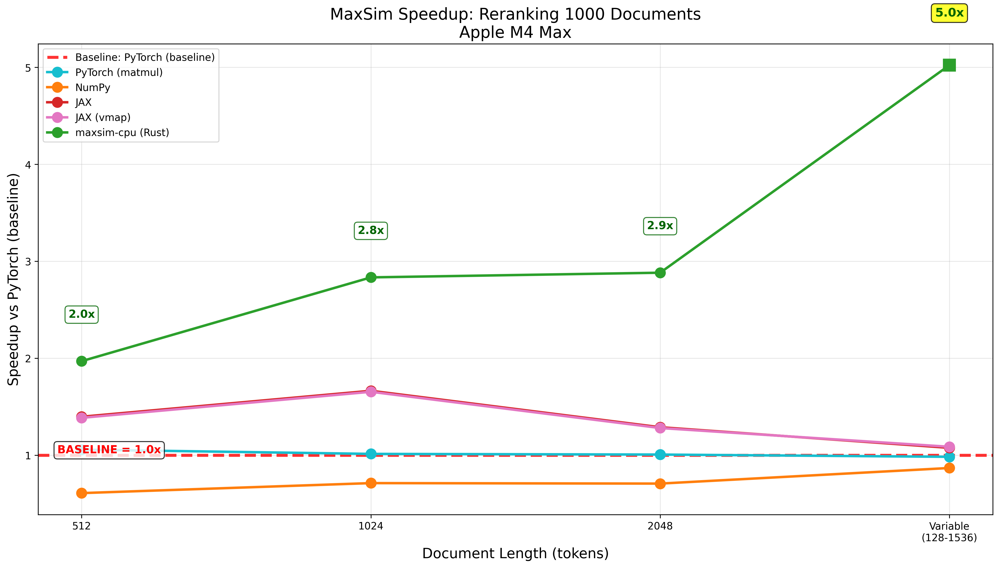
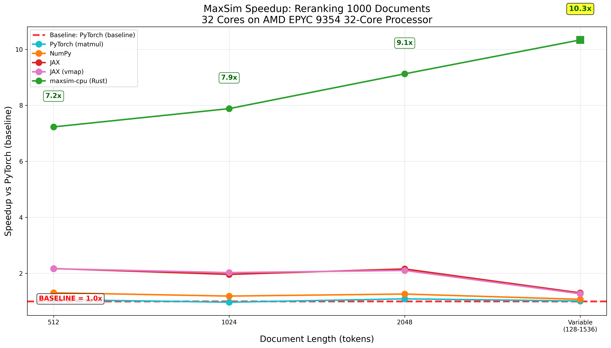

# maxsim-cpu

`maxsim-cpu` is a high-performance CPU implementation of MaxSim scoring for late-interaction (ColBERT, ColPali) workflows.

It is a python library written in Rust and powered by `libsxmm` on x86 CPUs and Apple Accelerate on ARM macs. It only supports Linux x86 machines and ARM Macs at the moment.

`maxsim-cpu` is built to run exclusively on CPU, and achieves speed-ups that scale with core count on the scoring machine. It's designed to be used in situations where index/scoring machines do not have access to GPUs, and achieves ~2-3x speed-ups on ARM macs and 5x speedups on Linux CPUs over common PyTorch maxsim implementations.

It also implements effective just-in-time batching and padding for variable documents, greatly reducing padding overhead and needless computations.

## Getting Started

Pre-built wheels are available on Pypi for Python 3.9 through 3.13 and can be installed in the usual way:

```bash
uv pip install maxsim-cpu # You may use vanilla pip install but why would you? If you're sophisticated, you could use `uv add` too!
```

Once installed, the simple API exposes two methods. For uniform-length inputs, you may use:

```python
import numpy as np
import maxsim_cpu

# Prepare normalized embeddings
query = np.random.randn(32, 128).astype(np.float32)  # [num_query_tokens, dim]

# NOTE: maxsim-cpu expects normalized vectors.
query /= np.linalg.norm(query, axis=1, keepdims=True)

docs = np.random.randn(1000, 512, 128).astype(np.float32)  # [num_docs, doc_len, dim]
# Normalize document embeddings...

# Compute MaxSim scores
scores = maxsim_cpu.maxsim_scores(query, docs)  # Returns [num_docs] scores
```

For variable length inputs, you should use the alternate `maxsim_scores_variable`:

```python
import numpy as np
import maxsim_cpu

# Prepare normalized embeddings
query = np.random.randn(32, 128).astype(np.float32)  # [num_query_tokens, dim]

# NOTE: maxsim-cpu expects normalized vectors.
query /= np.linalg.norm(query, axis=1, keepdims=True)

# Create variable-length documents as a list
docs = [
    np.random.randn(np.random.randint(50, 800), 128).astype(np.float32)  # Variable length docs
    for _ in range(1000)
]
# Normalize document embeddings...

# Compute MaxSim scores
scores = maxsim_cpu.maxsim_scores_variable(query, docs)  # Returns [num_docs] scores
```

## Platform Requirements

- **macOS**: Apple Silicon (M1+)
- **Linux**: x86_64 with AVX2 (Intel Haswell 2013+, AMD Excavator 2015+)

We currently do not support Windows or take advantage of AVX512 instructions, nor do we optimise caching for specific CPUs. Contributions/PRs in this direction are welcome!

## Building

We use `maturin` as our build system. 

#### Linux

The easy way to build `maxsim-cpu` from source on Linux is as follows:

```bash
# Install necessary system deps
apt-get install libssl-dev libopenblas-dev -y
apt-get install pkg-config -y
# Install tooling
uv pip install maturin patchelf numpy
# Install libxsmm
git@github.com:libxsmm/libxsmm.git && cd libxsmm && make STATIC=1 && make
# Install Rust
curl --proto '=https' --tlsv1.2 -sSf https://sh.rustup.rs | sh
. "$HOME/.cargo/env"
# Clone and install maxsim-cpu
git clone git@github.com:mixedbread-ai/maxsim-cpu.git
cd maxsim-cpu
RUSTFLAGS="-L native=$(pwd)/../libxsmm/lib" maturin build --release --features use-libxsmm
```

Step by step:
- This installs OpenSSL and OpenBLAS, which will be required for compiling, as well as pkg-config so they can be found easily.
- It then clones `libxsmm`, on which most of the performance depends, and installs it.
- Installs RUST and enables its environment
- Clones this repository and finally build it

You may modify it and remove any step depending on dependencies already present on your machine.

#### Mac

On Mac, the installation is simplified, assuming you use homebrew:
```bash
# Install maturin
uv pip install maturin
# Install patchelf
brew install patchelf
# Install Rust
curl --proto '=https' --tlsv1.2 -sSf https://sh.rustup.rs | sh
. "$HOME/.cargo/env"
# Clone and install maxsim-cpu
git clone git@github.com:mixedbread-ai/maxsim-cpu.git
cd maxsim-cpu
maturin build --release -q
```

## Performance

For documents of uniform lengths, performance on Linux is slower than Jax on 4 core machines and either somewhat faster or slower depending on the CPU at 8 cores, and always faster than alternatives on ARM Macs. For variable document lengths (evaluated as a uniform distribution between 128 and 1536 tokens), `maxsim-cpu` is always pretty fast thanks to more efficient batching.

### Mac M4 Ultra




### Linux AMD EPYC

#### 32 core limit performance



#### 16 core limit performance

*It seems our performance was hindered during benchmarking due to a Rayon config issue when limiting the available cores. Leaving reporting as-is for now but performance is expected to be considerably better on an actual 16-core CPU.*


